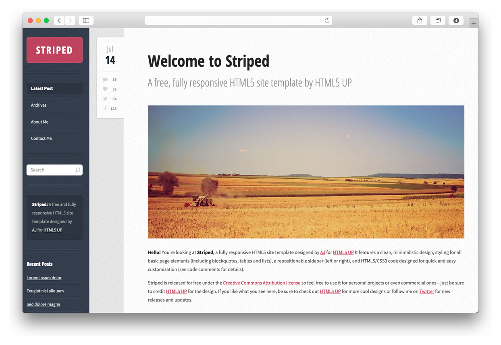

# Striped Skeleton for Grav



Striped by [HTML5UP](http://www.html5up.net), features a clean, minimalistic design, styling for all basic page elements, a repositionable sidebar (left or right), and HTML5/CSS3 code designed for quick and easy customization.

# Features

* HTML5 and CSS3
* Fully Responsive
* Various templates for presenting your content
* Repositionable sidebar (left or right),
* Calendar with actual date (post date for blog items)
* Styling for all basic page elements
* Styling for various modules
* Cross browser compatible
* Sharing buttons for Facebook and Twitter with share count.

## Basic Setup for a new Grav site

The simplest way to install Striped theme for Grav is to download and install the Striped Skeleton package:

1. [Download Striped Skeleton](http://getgrav.org/downloads/skeletons#extras)
2. Simply unzip the package into your web root folder.
3. Point your browser at the folder, job done!

**TIP:** Check out the [general Grav installation instructions](http://learn.getgrav.org/basics/installation) for more details on this process.

---

## Existing Grav site

It is possible to install just the theme, but page content will need to reference the [Striped theme](https://github.com/getgrav/grav-theme-striped)'s supported templates.  It is strongly advised to at least install the Striped Skeleton package to see the theme's capabilities in action.

To install  **just** the theme:

```
$ bin/gpm install striped
```

# Contact Form Configuration
For contact form configuration instructions please refer to [official documentatnion](http://learn.getgrav.org/advanced/contact-form). Make sure you installed Email and Form plugin though.
